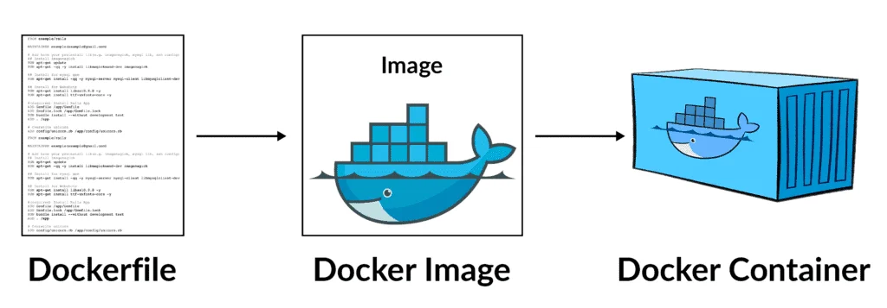

# INTRODUCCIÓN

[← Regresar a notas](../../README.md)  

----

### Docker
Docker es una plataforma que permite desplegar aplicaciones de forma aislada mediante <u>contenedores</u>.

### Contenedor
Un contenedor es una instancia en ejecución de una <u>imagen de Docker</u>.

### Imagen
Una imagen de Docker es un paquete inmutable que consolida, a partir del <u>Dockerfile</u>, todo lo necesario para ejecutar una aplicación, incluyendo el sistema operativo base, dependencias y código compilado. Esto garantiza una ejecución consistente en cualquier entorno.

### Dockerfile
Un Dockerfile es un archivo de texto que contiene instrucciones para automatizar la construcción de una imagen de Docker.

